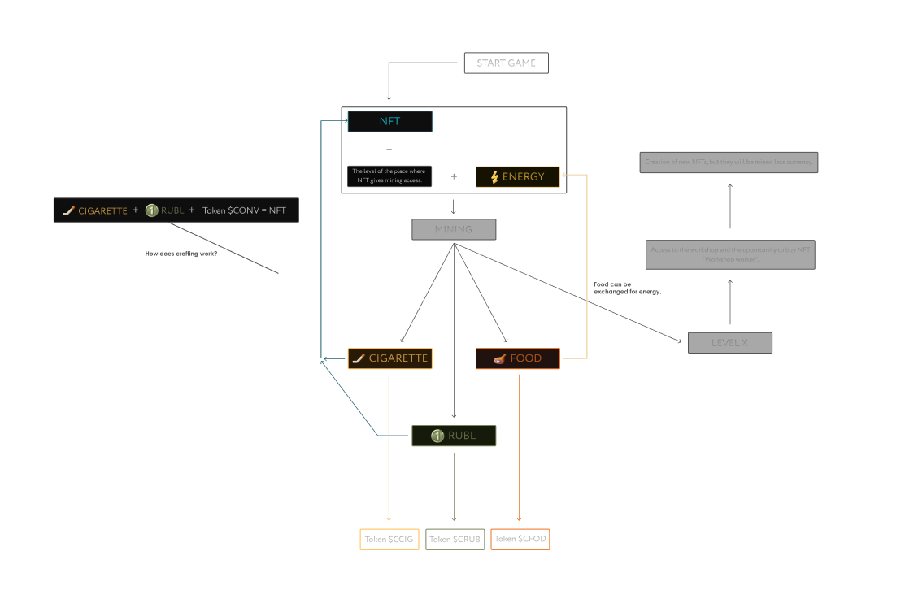

# Convicted Whitepaper 1

There are three economic currencies in the game: "Rubl", "Cigarettes", "Food", as well as two resources: "Authority", "Energy" and one indicator "Level". All of these parameters will interact with each other and create an economic balance. 

# About the game

This introductory paper was originally published in 2013 by Vitalik Buterin, the founder of Ethereum, before the project's launch in 2015. It's worth noting that Ethereum, like many community-driven, open-source software projects, has evolved since its initial inception.

While several years old, we maintain this paper because it continues to serve as a useful reference and an accurate representation of Ethereum and its vision. To learn about the latest developments of Ethereum, and how changes to the protocol are made, we recommend this guide. 

